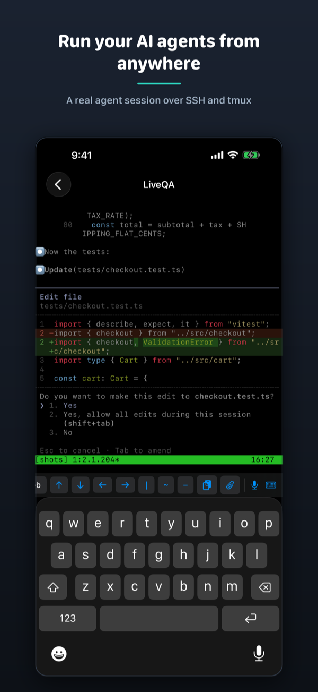
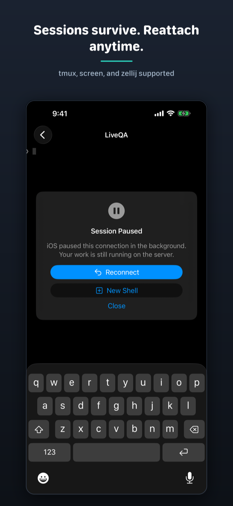
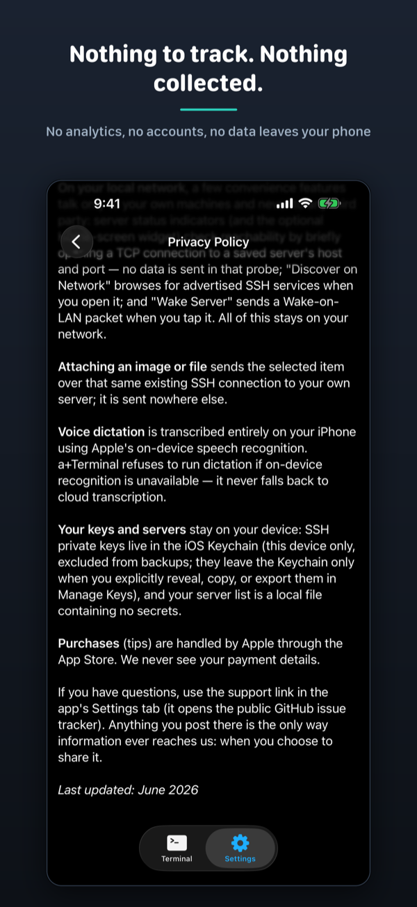

# a+Terminal

**The only agent control surface that works with any agent, on your own machine, over your own network, with no account and no relay.**

An agent asks for permission; your phone tells you; one tap answers it — and none of it touches a server that isn't yours. a+Terminal is a privacy-first iOS SSH terminal, **agent- and multiplexer-agnostic**: any CLI AI coding agent (Claude Code, Codex, aider, Gemini CLI, Hermes, …), any multiplexer (tmux, zellij, screen), over plug-and-play profiles you can extend yourself. The zero-data-collection claim is CI-enforced: a build fails if a network symbol appears outside the audited SSH/meshyy/VNC layers.

[](https://apps.apple.com/app/id6779393452)

Free, tip-supported. No features are paywalled, ever.

> Not affiliated with Anthropic, OpenAI, Google, or Nous Research; product names are trademarks of their respective owners.

## Screenshots

<p align="center">
  
  
  
</p>

## Features

- Two tabs: **Terminal** (sessions + servers) and **Settings**.
- First-class multiplexer scrolling: pan gestures become SGR mouse-wheel events, so your tmux/agent output scrolls like it does on the desktop.
- Attach an image or file from your phone over the existing SSH connection.
- On-device voice dictation straight into the terminal (never sent to a server).
- Live Activities + Dynamic Island session awareness with tap-to-reattach.
- **Monitor (VNC, beta):** a window onto your computer's screen sharing (macOS ARD auth) — pinch-zoom and pan. Pop the screen out into a floating Picture-in-Picture window to keep an eye on it while you use other apps. View-only by default; opt-in **Control mode** adds tap-to-click, drag, right-click, and a keyboard sheet that can unlock a locked Mac. When you have the same machine saved as an SSH server, a+Terminal streams its real mouse pointer position over SSH so the cursor tracks your physical mouse (macOS screen sharing doesn't report it) — automatically, no setup.
- **Localhost preview:** when a dev server on the machine you're SSH'd into prints `http://localhost:5173`, tap it. a+Terminal forwards that port over the SSH connection you already have and renders the page in the app — hot reload and WebSockets included, because it's a raw byte tunnel rather than a rewriting proxy. Nothing touches a third party and no account is involved; the tunnel's listener is bound to the phone's loopback only, so nothing else on your Wi-Fi can reach it. It's a preview, not a browser: it will only ever load loopback addresses, and it lives only while the app is in the foreground — or, if you pop it out into the floating window, for as long as that window is up. Optional console pane mirrors the page's `console.log` for the times you'd reach for devtools and there aren't any; off by default, since it's the only part that injects anything into your page.
- Reconnect where you left off: background drops offer reattach, with a live session picker when several multiplexer sessions are running.

## Privacy

**Zero data collection.** No analytics, no crash SDKs, no accounts, no third-party network calls. The only network traffic is your own SSH (and optional VNC monitor) connections to machines you configure.

Full policy: [privacy policy](https://aaroncx.github.io/a-plus-terminal/privacy/).

## Requirements

- iOS 26.0 or later, iPhone only.
- A machine you can reach over SSH (password or key auth; ed25519 and ECDSA keys supported).
- For Monitor mode: a machine with screen sharing / VNC enabled (macOS Screen Sharing works out of the box; reach it over Tailscale or an SSH tunnel).
- For Preview: a dev server running on the machine you're already SSH'd into — no extra setup, no agent to install. The forwarded port is bound to the phone's loopback only, so no other device on your network can reach it.

## Support

- Questions or bug reports: [GitHub Issues](https://github.com/AaronCx/a-plus-terminal/issues) — this is the support channel for the App Store listing.
- Guides: [tmux setup](https://aaroncx.github.io/a-plus-terminal/tmux-setup.html) and the [project site](https://aaroncx.github.io/a-plus-terminal/).

## Development

Requires Xcode 26+ (iOS 26 SDK), [XcodeGen](https://github.com/yonaskolb/XcodeGen) (`brew install xcodegen`).

```sh
make generate   # regenerate aPlusTerminal.xcodeproj from project.yml
make build      # build for the iOS simulator
make test       # run unit tests
```

The `.xcodeproj` is generated and gitignored — edit `project.yml` instead.

## License

MIT — see [LICENSE](LICENSE).
